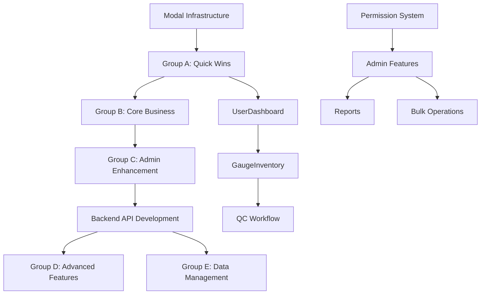

# Unified Frontend Implementation Roadmap - Instance 3

**Created**: 2025-09-06  
**Purpose**: Consolidated implementation strategy for modular frontend development  
**Current Status**: 40% feature parity with legacy system

## Executive Summary

This roadmap provides a unified strategy to achieve 100% feature parity between the legacy and modular frontends. Based on comprehensive analysis, the implementation is organized into 5 logical development groups with clear dependencies, prioritizing quick wins while building towards complex features.

**Key Findings**:
- 17 missing modal components (vs 10 existing)
- 60% of admin panel functionality missing
- Core business workflows incomplete (QC approval, bulk operations)
- Backend APIs vary: 40% ready, 30% partial, 30% missing

## 1. Implementation Groups Overview

### Group A: Quick Wins (20 hours)
**Backend Ready + LOW Complexity = Immediate Value**
- ✅ All APIs exist
- 🚀 No dependencies
- 👥 Impacts all user roles

### Group B: Core Business Functions (35 hours)
**Essential Operations + MODERATE Complexity**
- ✅ All APIs exist
- 🔗 Depends on Group A
- 👥 Critical for daily operations

### Group C: Administrative Enhancement (30 hours)
**Admin Tools + Mixed Complexity**
- ⚠️ Partial APIs (needs extension)
- 🔗 Depends on Groups A & B
- 👥 Admin/Inspector roles

### Group D: Advanced Operations (45 hours)
**Power Features + HIGH Complexity**
- ❌ Missing APIs (requires development)
- 🔗 Depends on Groups A, B, C
- 👥 Admin/Super Admin roles

### Group E: Data Management (30 hours)
**Import/Export + HIGH Complexity**
- ❌ Missing APIs (extensive work needed)
- 🔗 Depends on Groups A, B, C
- 👥 Admin roles

**Total Estimated Effort: 160 hours**

## 2. Detailed Implementation Plan

### Phase 1: Foundation (Groups A + B) - 55 hours

#### Group A: Quick Win Components
```yaml
1. HealthStatus Component (2 hours)
   Function: System health monitoring display
   Backend: GET /api/system/health ✅
   Location: /frontend/src/modules/system/HealthStatus.tsx
   Dependencies: None

2. PasswordModal (3 hours)
   Function: Current user password change
   Backend: PUT /api/users/me/password ✅
   Location: /frontend/src/modules/auth/modals/PasswordModal.tsx
   Dependencies: Modal infrastructure

3. CheckinModal (4 hours)
   Function: Gauge return with condition selection
   Backend: PUT /api/gauges/:id/checkin ✅
   Location: /frontend/src/modules/gauge/modals/CheckinModal.tsx
   Dependencies: Modal infrastructure

4. RejectModal (3 hours)
   Function: Generic rejection workflow
   Backend: POST /api/gauges/:id/reject ✅
   Location: /frontend/src/modules/gauge/modals/RejectModal.tsx
   Dependencies: Modal infrastructure

5. UserDashboard (8 hours)
   Function: Personal tools and assignments view
   Backend: GET /api/gauges/my-tools ✅
   Location: /frontend/src/modules/dashboard/UserDashboard.tsx
   Dependencies: None
```

#### Group B: Core Business Components
```yaml
1. GaugeInventory Component (15 hours)
   Function: Main gauge display with filtering
   Backend: GET /api/gauges (with filters) ✅
   Location: /frontend/src/modules/gauge/GaugeInventory.tsx
   Features:
     - Filter bar (search, status, type, location)
     - Category tabs (All, Large Equipment, Hand Tools, Thread)
     - Thread sub-tabs (All Thread, Ring, Plug)
     - Admin alerts section
     - Gauge count display
   Dependencies: Group A components

2. ReviewModal (8 hours)
   Function: QC approval workflow
   Backend: PUT /api/gauges/:id/qc-approve ✅
   Location: /frontend/src/modules/gauge/modals/ReviewModal.tsx
   Features:
     - Gauge details display
     - Approve/Reject actions
     - Rejection reason selection
   Dependencies: RejectModal

3. CreateGaugeModal (12 hours)
   Function: New gauge creation form
   Backend: POST /api/gauges ✅
   Location: /frontend/src/modules/gauge/modals/CreateGaugeModal.tsx
   Features:
     - Multi-step form
     - Type-specific fields
     - Validation
   Dependencies: Modal infrastructure
```

### Phase 2: Enhancement (Group C) - 30 hours

```yaml
1. AddUserModal (10 hours)
   Function: User creation with role assignment
   Backend: POST /api/admin/users ⚠️ (partial)
   Location: /frontend/src/modules/admin/modals/AddUserModal.tsx
   Required APIs:
     - GET /api/admin/roles ❌
     - POST /api/admin/users/:id/roles ❌
   Dependencies: User management infrastructure

2. RejectionReasonsManagement (8 hours)
   Function: Manage QC rejection reasons
   Backend: CRUD /api/admin/rejection-reasons ✅
   Location: /frontend/src/modules/admin/RejectionReasons.tsx
   Features:
     - Add/Edit/Delete reasons
     - Activate/Deactivate
     - Protected reason handling
   Dependencies: Admin panel structure

3. SystemSettingsEnhancement (12 hours)
   Function: Complete system configuration UI
   Backend: GET/PUT /api/admin/settings ⚠️ (partial)
   Location: /frontend/src/modules/admin/SystemSettings.tsx
   Features:
     - Calibration settings
     - Checkout settings
     - System maintenance
   Dependencies: Admin panel structure
```

### Phase 3: Advanced Features (Groups D + E) - 75 hours

#### Group D: Advanced Operations
```yaml
1. BulkUpdateModal (15 hours)
   Function: Mass gauge operations
   Backend: POST /api/gauges/bulk-update ❌
   Location: /frontend/src/modules/gauge/modals/BulkUpdateModal.tsx
   Features:
     - Multi-select interface
     - Bulk field updates
     - Operation preview
   Backend Requirements:
     - Bulk update endpoint
     - Transaction support
     - Progress tracking

2. SystemRecoveryTool (12 hours)
   Function: Fix stuck gauges (Super Admin)
   Backend: POST /api/admin/system-recovery ✅
   Location: /frontend/src/modules/admin/SystemRecovery.tsx
   Features:
     - Gauge state analysis
     - Recovery operations
     - Audit trail
   Dependencies: Super admin permissions

3. ReportsSystem (18 hours)
   Function: Generate and export reports
   Backend: GET /api/reports/:type ❌
   Location: /frontend/src/modules/reports/*
   Features:
     - Report type selection
     - Parameter configuration
     - Export formats (PDF, Excel, CSV)
   Backend Requirements:
     - Report generation service
     - Export functionality
     - Scheduled reports
```

#### Group E: Data Management
```yaml
1. DataManagementTab (20 hours)
   Function: Import/Export operations
   Backend: POST /api/admin/import ❌
   Location: /frontend/src/modules/admin/DataManagement.tsx
   Features:
     - File upload interface
     - Import mapping
     - Export configuration
     - Progress tracking
   Backend Requirements:
     - File processing service
     - Import validation
     - Export templates

2. UserDetailsModal (10 hours)
   Function: Complete user profile management
   Backend: GET/PUT /api/admin/users/:id ❌
   Location: /frontend/src/modules/admin/modals/UserDetailsModal.tsx
   Features:
     - Profile editing
     - Permission management
     - Activity history
   Backend Requirements:
     - Extended user endpoints
     - Activity tracking
```

## 3. Critical Path Dependencies



## 4. Backend API Development Requirements

### Immediate Needs (Phase 1-2)
```javascript
// User Management Extensions
router.get('/api/admin/users/:id', getUserDetails);
router.put('/api/admin/users/:id', updateUser);
router.post('/api/admin/users/:id/reset-password', resetUserPassword);
router.get('/api/admin/roles', getRoles);
router.post('/api/admin/users/:id/roles', assignRoles);

// System Settings
router.get('/api/admin/settings/:section', getSettingsSection);
router.put('/api/admin/settings/:section', updateSettingsSection);
```

### Advanced Needs (Phase 3)
```javascript
// Bulk Operations
router.post('/api/gauges/bulk-update', bulkUpdateGauges);
router.post('/api/gauges/bulk-checkout', bulkCheckoutGauges);
router.post('/api/gauges/bulk-return', bulkReturnGauges);

// Reporting
router.get('/api/reports/types', getReportTypes);
router.post('/api/reports/generate', generateReport);
router.get('/api/reports/:id/download', downloadReport);

// Data Management
router.post('/api/admin/import/validate', validateImportFile);
router.post('/api/admin/import/execute', executeImport);
router.post('/api/admin/export', exportData);
```

## 5. Architectural Decisions Required

### State Management Strategy
**Issue**: Modal state management patterns vary  
**Decision Needed**: Standardize on React Query + Context pattern  
**Recommendation**: Create modal state hook template

### Permission Integration
**Issue**: Complex role-based UI rendering  
**Decision Needed**: Centralized permission checking  
**Recommendation**: Extend existing usePermissions hook

### Error Handling
**Issue**: Inconsistent error boundaries  
**Decision Needed**: Standardized error handling  
**Recommendation**: Create ErrorBoundary wrapper for all modals

### API Integration Pattern
**Issue**: Mixed service patterns  
**Decision Needed**: Consistent API layer  
**Recommendation**: Extend existing service classes

## 6. Risk Mitigation Strategies

### Technical Risks
| Risk | Impact | Mitigation |
|------|--------|------------|
| Backend API delays | HIGH | Implement mock services first |
| State management complexity | MEDIUM | Use established patterns |
| Performance degradation | MEDIUM | Implement lazy loading |
| Testing coverage gaps | HIGH | TDD for critical paths |

### Resource Risks
| Risk | Impact | Mitigation |
|------|--------|------------|
| Developer availability | HIGH | Phase-based delivery |
| Scope creep | MEDIUM | Strict feature freeze per phase |
| Integration issues | MEDIUM | Early integration testing |

## 7. Quality Gates & Validation

### Phase 1 Completion Criteria
- [ ] All Group A components functional
- [ ] Core workflows operational
- [ ] 70% unit test coverage
- [ ] User acceptance testing passed

### Phase 2 Completion Criteria
- [ ] Admin panel 80% complete
- [ ] All existing APIs integrated
- [ ] Performance benchmarks met
- [ ] Security audit passed

### Phase 3 Completion Criteria
- [ ] 100% feature parity achieved
- [ ] All advanced features operational
- [ ] Load testing completed
- [ ] Documentation complete

## 8. Success Metrics

### Functional Metrics
- Modal count: 10 → 27 (170% increase)
- Admin features: 40% → 100% complete
- User workflows: Basic → Full implementation
- API coverage: 40% → 100%

### Performance Targets
- Component load time: <200ms
- API response time: <500ms
- Bundle size increase: <30%
- Memory usage: <100MB

### User Experience Goals
- Zero workflow interruptions during migration
- Consistent UI/UX patterns
- Improved error messaging
- Enhanced accessibility (WCAG 2.1 AA)

## 9. Recommended Implementation Sequence

### Phase 1: Quick Wins
- Implement Group A components
- Establish development patterns
- Set up testing framework

### Phase 2: Core Business
- Complete Group B components
- Integrate with existing systems
- User acceptance testing

### Phase 3: Admin Enhancement
- Implement Group C features
- Backend API development
- Security review

### Phase 4: Advanced Features
- Develop Groups D & E
- Performance optimization
- Final testing and deployment

## Conclusion

This roadmap provides a systematic approach to achieving feature parity while maintaining code quality and system stability. The phased approach allows for incremental delivery of value while building towards complete functionality. Success depends on maintaining focus on the critical path dependencies and avoiding scope creep within each phase.

The modular architecture provides a solid foundation for these implementations, and following this roadmap will result in a fully-featured, maintainable frontend system that exceeds the capabilities of the legacy system.